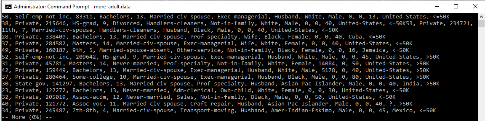
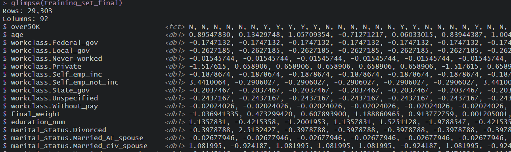

  
```{r 01_source_include, echo=FALSE, message=FALSE, include=FALSE}

  knitr::opts_chunk$set(message=FALSE)
  knitr::opts_chunk$set(warning=FALSE)
  knitr::opts_chunk$set(echo = FALSE) ## do not show code unless told to
  knitr::opts_chunk$set(comment = "") ## remove the # from output 
 
  # the almighty tidyverse, you can't do without
  if (!require(tidyverse)) install.packages("tidyverse", repos = "http://cran.us.r-project.org")
  
  # the beautiful colorbrewer, bring life to your charts
  if (!require(RColorBrewer)) install.packages("RColorBrewer", repos = "http://cran.us.r-project.org")
  
  # for LaTeX (pdf) compilation
  if(!require(tinytex)) {
    install.packages("tinytex", repos = "http://cran.us.r-project.org")
    tinytex::install_tinytex()  # install TinyTeX
  }
  
  # for the amazing tables package by Hao Zhu
  if(!require(kableExtra)) install.packages("kableExtra", repos = "http://cran.us.r-project.org")
  
  # for arranging objects like charts horizontally and vertically using arrangeGrob(), etc
  if(!require(gridExtra)) install.packages("gridExtra", repos = "http://cran.us.r-project.org")

  # for ROC curves  
  if(!require(ROCR)) install.packages("ROCR", repos = "http://cran.us.r-project.org")

  library(dplyr)
  library(ggplot2)
  library(broom)
  library(scales)
  library(RColorBrewer)
  library(tinytex)
  library(kableExtra)
  library(gridExtra)
  library(ROCR)
  
  #######################################################################
  ## functions
  #######################################################################
  fnSafePercent <- function(x, accuracy=1){
    if(is.numeric(x)) 
      return(percent(x, accuracy = accuracy))
    else
      return(x)
  }
  
  
  ################################################################################
  # read the data files needed for report. 
  # these should have been generated in the rda folder by running the model
  ################################################################################
  # read the original 
  
  # from the report file perspective
  rda_path <- "../rda"

  #1. load datasets
  # this is tne original training dataset
  adult_income_train <- readRDS( file.path( rda_path, "adult_income_train.rda"))
  
  ## the original validation set
  adult_income_validation  <- readRDS(file.path( rda_path, "adult_income_validation.rda"))
  
  # this is the engineered for visualization
  adult_income <- readRDS(file.path( rda_path, "adult_income.rda"))
  
  # read the final dataset used for training after splitting
  training_set_final <- readRDS(file.path( rda_path, "training_set_final.rda"))
  
  # the test (holdout) set
  test_set_final <- readRDS(file.path( rda_path, "test_set_final.rda"))
  
  
  
  ########################################################
  # knn results
  ########################################################
  #load knn objects for report
  knn_model_1_results <- readRDS(file.path( rda_path, "knn_model_1_cv_results.rda"))
  knn_model_2_results <- readRDS(file.path( rda_path, "knn_model_2_cv_results.rda"))
  
  knn_confusionMatrix_1 <- readRDS(file.path( rda_path, "knn_model_1_confusionMatrix.rda"))
  knn_confusionMatrix_2 <- readRDS(file.path( rda_path, "knn_model_2_confusionMatrix.rda"))
  
  knn_confusionMatrix_1_tidy <- readRDS(file.path( rda_path, "knn_model_1_confusionMatrix_tidy.rda"))
  knn_confusionMatrix_2_tidy <- readRDS(file.path( rda_path, "knn_model_2_confusionMatrix_tidy.rda"))
  
  
  ###############################################################################
  #load randomForest objects for report
  rf_model_1_results <- readRDS(file.path( rda_path, "rf_model_1_results.rda"))
  rf_model_1_cm    <- readRDS(file.path( rda_path, "rf_model_1_confusionMatrix.rda"))
  
  rf_model_2_results <- readRDS(file.path( rda_path, "rf_model_2_results.rda"))
  
  rf_model_3 <- readRDS(file.path( rda_path, "rf_model_3.rda"))
  rf_model_3_results <- readRDS(file.path( rda_path, "rf_model_3_results.rda"))
  
  roc_predictions_1 <- readRDS(file.path( rda_path, "roc_predictions_1.rda"))
  roc_predictions_2 <- readRDS(file.path( rda_path, "roc_predictions_2.rda"))

  roc_performance_1 <- readRDS(file.path( rda_path, "roc_performance_1.rda"))
  roc_performance_2 <- readRDS(file.path( rda_path, "roc_performance_2.rda"))
  
  # load final model performace stats
  test_performance_stats <- readRDS(file.path( rda_path, "test_performance_stats_final.rda")) 
  confusionMatrix_final    <- readRDS(file.path( rda_path, "confusionMatrix_final.rda"))
  feature_importance <- readRDS(file.path( rda_path, "important_features.rda"))
  

```


```{r my_custom_themes}
    
    #########################################################################
    # my custom bar chart theme
    #########################################################################
    
    #plot.title
    chart_main_title_theme <- theme(plot.title = element_text(size = 10))
    
    #axis title and text
    chart_axis_theme <-  theme(axis.title =  element_text(face = "bold"),
                                axis.text = element_text(size = 10) ) 
                             
    angled_30_x_axis_labels_theme <- theme(axis.text.x = element_text(angle = 30, vjust=.8, hjust=0.8))
    angled_45_x_axis_labels_theme <- theme(axis.text.x = element_text(angle = 45, vjust=.8, hjust=0.8) )
    angled_90_x_axis_labels_theme <- theme(axis.text.x = element_text(angle = 90) )
    
    classic_chart_theme <- theme_classic() + chart_main_title_theme + chart_axis_theme
    
    gray_chart_theme <- theme_gray() + chart_main_title_theme + chart_axis_theme 
    
    minimal_chart_theme <- theme_minimal() + chart_main_title_theme + chart_axis_theme
    
    gray_chart_theme_45 <- theme_gray() + chart_main_title_theme +
      chart_axis_theme + angled_45_x_axis_labels_theme
    
    #################################################
    ##
    ## http://applied-r.com/rcolorbrewer-palettes/
    ## 
    ## set color palette:
    ##  - scale_fill_brewer(palette = "RdYlGn") 
    ##  - scale_fill_manual(values = my_colors_17) 
    ##
    ## display.brewer.pal(7,"BrBG")
    ## brewer.pal(7,"BrBG")
    ##
    # create my own color pallete for long categorical list
    # pick similar color blind friendly from different pallettes
    
    my_colors_20 <- c("#8DD3C7", "#FFFFB3", "#BEBADA", "#FB8072", "#80B1D3", "#FDB462", "#B3DE69", 
                      "#FCCDE5", "#FEE0D2", "#D9D9D9", "#BC80BD", "#CCEBC5", "#FFED6F", "#31A354",
                       "#034E7B", "#006837","#D95F0E" ,"#993404", "#3690C0" ,"#0570B0"
                      )
    
    my_colors_8<-c("#F4A582", "#92C5DE","#66C2A5", "#A6D854","#FFD92F", "#66BD63", "#1A9850", "#FDAE61", "#D9EF8B")
    

```


## Introduction
Income disparity is common in every society and it's probably been around since man has been able to measure it. There are various reasons why income disparities exist. These include age, gender, race, level of education, etc.  

For instance, with respect to age, younger people who have just entered the workforce may earn less than their counterparts who have been in the industry for many years. The level of education may also explain income disparities since some high paying jobs often require skilled and highly educated individuals.   

Even different geographic regions or cities may offer different levels of income since some high paying jobs are sometimes more concentrated in some regions or cities than others. However, it is still difficult to measure how much these factors determine one's income.   

In this project, I will I apply kNN and randomForest to a dataset containing various attributes (predictors) and individual's income level (above or below $50K), and predict the individual's income level. 

The kNN and randomForest algorithms were chosen because they are very easy to train, and they are able handle a wide range data including a mix of categorical and numeric variables and offer good performance. 


For details on reproducing the analysis presented in this document, refer to the Technical Details section.

\newpage


## The original data

__Source__  
The data used in this project is part of the UCI machine learning datasets provided to the public. It can be found at:  https://archive.ics.uci.edu/ml/machine-learning-databases/adult/.  

   
Three main files are provided as part of the dataset.  
  
* adult.names
* adult.data
* adult.test
 
The _adult.names_ file,  provides very useful information about the data.  The _adult.data_ and _adult.test_ files are the training and test sets. The data had already been split into training and test sets by the contributer(s). The training data contains _32561_ records. The test set contains _16281_ records, about 50% of the training set.  This provides a good amount of data for training while leaving enough for validation. Each record in the datasets represents an observation.   

The documentation indicates that the original data was retrieved from the 1994 census bureau database (http://www.census.gov/ftp/pub/DES/www/welcome.html), so the samples were taken from real dataset. The U.S. population and workfoce have changed dramatically since 1994, so the patterns in this data may be different from when the samples were originally taken. 
  

__Reading the data__   
A quick peek at the data reveals that there are no column names. However, descriptions in the _adult.names_ file provides useful information in naming the columns.   
   
      
    

  
      
__Code to read the data__
    
       
```{r 02_read_data_files, eval=FALSE, echo=TRUE }


# use wrapr::qc() function to create a list of quoted string for the column headers
COL_HEADERS <- qc(age, workclass, final_weight, education, education_num,
                  marital_status, occupation, relationship, race, sex,
                  capital_gain, capital_loss, hours_per_week, native_country, Income)

# read training and test datasets into memory
adult_income_train <- read.csv(TRAINING_DATA_PATH, col.names = COL_HEADERS)
adult_income_validation  <- read.csv(VALIDATION_DATA_PATH, col.names = COL_HEADERS)

# trim all character columns
adult_income_train <- adult_income_train %>% mutate(across (where(is.character), str_trim))
adult_income_validation  <- adult_income_validation %>% 
  mutate(across (where(is.character), str_trim))


```
   
\newpage

__Structure of the dataframe__
   
   

The data contains 15 columns;  the _Income_ column is the response variable with the other fourteen columns being the independent variables. The structure of the dataframes looks as below:   
   
      
```{r dataframe_structure_train, message=FALSE, warning=FALSE, echo=TRUE}

 glimpse(adult_income_train) 
  
```
\par\noindent\rule{\textwidth}{0.4pt}

```{r dataframe_structure_validation, message=FALSE, warning=FALSE, echo=TRUE}

 glimpse(adult_income_validation) 
  
```

\newpage   

## Data quality checks
Although the data for this analysis has previously been cleaned by the team that made it available to UCI, a few things had to be checked to make sure the data is ready to be transformed and used in an analysis.
  
__1. Verify correct number of records read__.
Based on the documentation in the _adult.names_, there are 32561 records in the training set.

__2. Check for invalid/missing data (NAs, invalid zeros for age, etc )__. Verify the presence of NA in all columns. 
No NAs (null values) are found in both train and test sets. However, some of the categorical columns have questions mark (?) as values. Again, according to the documentation, these were missing values; the NAs (null values) had been replaced with questions marks.

__3. Numeric variables__. Check the range of values to make sure they do not include invalid values, e.g. age should be greater than zero, and not excessively high number.

__4. Categorical values__. Check the number of levels.

The following code was used for the basic sanity checks described above.   
  
    
### Basic data quality checks - data read
```{r 05_data_quality_checks, message=FALSE, warning=FALSE, echo=TRUE}

#####################################################################
## DATA QUALITY CHECKS
#####################################################################

# 1. check that correct number of rows was read
TRAIN_NUM_OF_ROWS_EXPECTED <- 32561
VALIDATION_NUM_OF_ROWS_EXPECTED  <- 16281

verify_stats <- data.frame("Item" = c("Number of row (training set)", 
                                      "Number of row (test set)"))
verify_stats$Expected <- c(TRAIN_NUM_OF_ROWS_EXPECTED, VALIDATION_NUM_OF_ROWS_EXPECTED)
verify_stats$Actual   <- c(nrow(adult_income_train), nrow(adult_income_validation))

#2. check for NA in all columns
verify_stats$HasNA   <- c(any(is.na(adult_income_train)), any(is.na(adult_income_validation)))

colnames(verify_stats) <- c("", "Expected", "Actual", "Has Nulls")
kbl(verify_stats, booktabs = T, caption = "Basic data quality checks") %>%
kable_styling(latex_options = c("striped", "hold_position")) %>% 
  column_spec(3, color = "red") %>% 
  column_spec(4, color = "blue") 

```

From the table, it appears that each dataset is off by one record. Since this is not a large number, I will ignore it. We also see that there are no NAs in each dataset.


\newpage


### Basic data quality check - min/max for numeric data
```{r 07_categorical_numerical_data_min_max, echo=TRUE}

#3. numeric columns: check range of values, min/max

# function to check min/max
fnFindMinMax <- function(myFeature){
  data.frame("min" = min(myFeature), "max" = max(myFeature))
}

sapply( adult_income_train %>% select(where(is.numeric)), fnFindMinMax) %>% 
  kbl(booktabs=T, caption="Numeric Variables min/max") %>% 
  kable_styling(latex_options = c("striped", "hold_position")) %>% 
  column_spec(0, bold=T) %>% 
  row_spec(0, bold=T) 

```

  
    
### Basic data quality check - categorical data unique values
```{r 08_categorical_data_unique_values, message=FALSE, warning=FALSE, echo=TRUE}

#4. for categorical values, inspect the unique values
fnShowUniqueValues <- function(myFeature){
  unique(myFeature)
}

adult_income_train %>% select(where(is.character)) %>% sapply(fnShowUniqueValues)

```
  
From the listings, there are no unusual values for either the numeric or the categorical data. As mentioned earlier,  three variables (workclass, occupation, and native_country) do have the "?" as one of the values, meaning these three variables originally had null values which have been replaced. All the data, including the "?",  will be used in the analysis.


\newpage  
    
## Data Visualization and Exploration

### Equal access is not equal gain
Even though one can argue that the U.S. population has equal access to education and employment, we know from experience that there are many factors or barriers that force people into certain income groups. These factors includes levels of education, gender, race, geographic areas people live in, to mention a few. 
  
In this section, I explore the data to find general properties and patterns. The dataset contains many categorical features, so I am very interested in learning how income differs across different categories. Since the response variable is categorical, it's not possible to  average incomes across different categories, however, the proportion of people with income over 50K across different categories can be compared. 

Since there are many variables to explores, I focus on a few. The following questions were used as a guide for the data exploration.
  
### Questions
__1. Age__
  
* What age group dominates the workforce? Which age group has the highest proportion of over 50K earners?
* Age can often determine how long a person has been in the workforce, and hence a higher income since as people stay longer in the workfoece, they advance in their careers, aften incressing their income.  Do people in different age groups have different income?   Do older workers earn more than younger workers?


__2. Sex__

* The dataset is distributed between males and females workers; what proportion of each sex is represented in the data?  
* Do the proportions represent the gender composition in the the general U.S. population?    
* Which sex tends to have higher income?  

__3. Level of education__

* Level of education can also be a strong determinant of one's income. Does the data suggest that people with higher levels of education have higher income?

__4. Capital Gain/Capital Loss__

* Can the amount of capital gain or loss indicate an individual's income? 


### Data Distribution

#### Prevalance of people earning over 50K.
Out of the `r  nrow(adult_income)` records in the training set, only `r  percent((adult_income$Income %>%  table() %>% prop.table())[">50K"], accuracy = 1)` (`r (adult_income$Income %>%  table()) [">50K"]`)
has income over 50K. Therefore, this sample has a much lower percentage of people earning over 50K and does not exactly reflect the current US income distribution which has about 45% of people earning over 50K^[https://www.cs.mcgill.ca/~rwest/wikispeedia/wpcd/wp/h/Household_income_in_the_United_States.htm].

\newpage

#### Numeric Variables Distribution  
I start by visualizing the distribution of the numeric features. 

````{r summary_numeric_vars, echo=T }

adult_income %>% select(where(is.numeric)) %>% summary()

````


````{r 12_scatterplots_1 }

par(mfrow=c(2,3)) 
hist(adult_income$age, main = "age Distribution", xlab = "age")
hist(adult_income$final_weight, main = "final_weight Distribution", xlab = "final_weight")
hist(adult_income$education_num, main = "education_num Distribution", xlab = "education_num \n (number of years of education)")
hist(adult_income$hours_per_week, main = "hours_per_week Distribution", xlab = "hours_per_week")
hist(adult_income$capital_gain, main = "capital_gain Distribution", xlab = "capital_gain")
hist(adult_income$capital_loss, main = "capital_loss Distribution", xlab = "capital_loss")

````

In general there is a wide range of values for the different variables.


Among the six numeric variables, variable _final_weight_, has the widest range (```r min(adult_income$final_weight)``` - ```r max(adult_income$final_weight)```). This is followed by the _capital_gain_ and _capital_loss_; all three variables are also very highly right-skewed.  

Variables _capital_gain_ and _capital_loss_ both have a mean and median of zero and a very small averages, reflecting on the large number of records having a value of zero (no capital gain or loss). In fact for _capital_gain_, only `r  percent((adult_income %>% filter(capital_gain > 0) %>% nrow())/nrow(adult_income), accuracy=1)` reporting gains and `r  percent((adult_income %>% filter(capital_gain == 0) %>% nrow())/nrow(adult_income), accuracy=1)` reported a value of zero.  

Variable _education_num_ is the more normally distributed than the rest, followed by _age_, and _hours_per_week_, even though _age_ is still right-skewed. 

The _hours_per_week_ variable is a little bit of bell curve with a mean and median being same ```r round(mean(adult_income$hours_per_week))```, meaning the majority of people are working fourty hours a week. However, one surprising thing is the presence of near 100hrs per week for some individuals. Although not a significant proportion, it is important to note that ```r adult_income %>% filter(hours_per_week>=70) %>% nrow() ```  individuals in this dataset work over seventy hours or more per work.

The _age_ summary statistics and the histogram show a right-skewed distribution with a mean of 39 and median of 37 years. This indicates, as expected, that the bulk of the workforce is concentrated in the younger age groups^[https://www.bls.gov/careeroutlook/2017/article/older-workers.htm].  

```{r 13_age_distribution}

median_age <- median(adult_income$age)
mean_age <- round(mean(adult_income$age))
mean_label   <- paste("Mean:", mean_age)
median_label <- paste("Median age:", median_age)

# add outliers label to far right 
adult_income %>% ggplot(aes(age)) + geom_histogram(binwidth = 2) + gray_chart_theme + 
  ggtitle("Age Distribution") +
  xlab("Age") + ylab("Count") +
  geom_vline(xintercept = mean_age, col = "red",lwd = 1) + 
  geom_vline(xintercept = median_age, col = "blue",lwd = 1) + 
  annotate("text", x = 45, y = 100, label = mean_label, col = "white", size = 4) +
  annotate("text", x = 28, y = 500, label = median_label, col = "white", size = 4)

```
  
It can be seen from the summary statistics that while the minimim age in the workforce is 17 we see some ninety year olds still in the workforce; hopefully these seniors are not drawn to work by the need for income but rather by the need to stay active. 


\newpage

#### Categorical Variable Distributions  
  
__Race and gender__. With race, the largest proportion is White ```r (table(adult_income$race) %>% prop.table() )["White"] %>% fnSafePercent(accuracy = 1)```. The rest is divided among Black (```r (table(adult_income$race) %>% prop.table() )["Black"] %>% fnSafePercent(accuracy = 1)```), and the others.  

When it comes to gender, the sample is predominantly _male_ which makes up ```r (table(adult_income$sex) %>% prop.table() )["Male"] %>% fnSafePercent(accuracy = 1)``` of the sample; the rest is _female_. 


__Education__. Education is one of the categorical variables with enourmous amount of space (```r unique(adult_income$education) %>% length()``` levels). The categories range from Preschool to Doctorate degree. High school diploma is the largest category
(```r (table(adult_income$education) %>% prop.table() )["HS-grad"] %>% fnSafePercent(accuracy = 1)```), followed by _Some-college_ 
(```r (table(adult_income$education) %>% prop.table() )["Some-college"] %>% fnSafePercent(accuracy = 1)```), and _Masters_ 
(```r (table(adult_income$education) %>% prop.table() )["Bachelors"] %>% fnSafePercent(accuracy = 1)```).   

In addition to _education_ categorical variable, the _education_num_ has the number of years of education for each individual.  In essence these two vaiables may be reporting the same information.
   
When the categories are collapsed into more broader categories with fewer levels, it becomes even more clear that the vast majority of the individuals have no college degree. This may explain why the majority of the individuals earn less than 50K.  


``` {r education_distribution_original, fig.height=3.3, caption="Education Distribution (Original Categories)" }

  adult_income %>%
    mutate(education = education %>% fct_infreq() %>% fct_rev()) %>%
    ggplot(aes(education, fill=education)) +  
       scale_fill_manual(values = my_colors_20)   +
        geom_bar() +  ggtitle("Education Distribution - Original Categories")  +
        gray_chart_theme_45  + theme(legend.position = "none") 
  
```

``` {r education_distribution_general, fig.height=3.3, caption="Education Distribution (General Categories)" }
  adult_income %>% 
    ggplot(aes(education_collapsed, fill=education_collapsed)) +
      scale_fill_brewer(palette = "Set2")   +
      geom_bar() +  ggtitle("Education Distribution using more general categories")  +  
      xlab("education") + gray_chart_theme + theme(legend.position = "none") 
 
 
```
\newpage

__Workclass__.
The _workclass_ variable is more like job sectors, has eight categories and one missing or not specified (?) category. The largest category is Private (```r (table(adult_income$workclass) %>% prop.table() )["Private"] %>% fnSafePercent(accuracy = 1)```), the rest is split among the other categories. There are some outliers (Never-worked, and Without-pay) with a counts of ```r (table(adult_income$workclass) )["Never-worked"] ``` and ```r  (table(adult_income$workclass) )["Without-pay"] ``` repectively.
  
      
__Occupation__. 
Another important variable in the dataset is _occupation_, a categorical variable with 15 levels,  one missing (?) category.  

```{r occupation_original }

  categories_count <- fct_count (adult_income$occupation)
  colnames(categories_count) <- c("Category", "Count")
  
  categories_count %>% 
  kbl(booktabs=T, caption="Occupation by Category - Orginal Categories") %>% 
    kable_styling(latex_options = c("striped", "hold_position")) %>% 
    column_spec(0, bold=T)
```


```{r occupation_original_chart, fig.height=4, caption="Occupation Distribution" }
adult_income %>%
  mutate(occupation = occupation %>% fct_infreq() %>% fct_rev()) %>%
  ggplot(aes(occupation, fill=occupation)) +  geom_bar() +  ggtitle("Occupation Distribution") + xlab("") +  coord_flip() + 
  scale_fill_manual(values = my_colors_20) +
  coord_flip() + theme(legend.position = "none") 

```
\newpage

For visualization purposes, I merged the _occupation_ categories into new categories based on the occupation classifications defined by US Bureau of Labor Statistics (BLS). These categories (classifications) are known as the Standard Occupation Classifications (SOC)
^[For more information on SOC occupational classifications, see https://www.bls.gov/soc/]. 

The SOC defines many categories but the following are the ones used:

* Management_business_science_and_arts
* Service
* Sales_and_Office
* Natural_resources_construction_and_maintenance
* Production_transportation_and_material_moving  
  

```{r 16_occupation_original_chart}
  
  categories_count <- fct_count (adult_income$occupation_collapsed) 
  colnames(categories_count) <- c("Category", "Count")
  
  categories_count %>% 
  kbl(booktabs=T, caption="Occupation by Category \n Based on SOC Classifications") %>% 
    kable_styling(latex_options = c("striped", "hold_position")) %>% 
    kable_styling(full_width = T)  %>% 
    column_spec(0, bold=T)

adult_income %>%
  mutate(occupation_collapsed = occupation_collapsed %>% fct_infreq() %>% fct_rev()) %>%
  ggplot(aes(occupation_collapsed, fill=occupation_collapsed)) +  geom_bar() +  
  ggtitle("Occupation by Category \n Based on SOC Classifications") + xlab("") + 
  scale_fill_brewer(palette = "Set3")   +
  coord_flip() + theme(legend.position = "none") 

```
\newpage

### Trends

In this section I will explore the data in an attempt to find some trends.

__Income and Age__. One of the questions asked earlier was whether age can indicate an individual's income level. The graph below shows that indeed, overall, there is a positive relationship. The proportion of individuals earning over 50K increases with age  and peaks around the fifties, before starting to decline. 

```{r age_and_income_and, fig.height=3, fig.width=5}
  
  # age_group column has already been computed and added to the dataframe 
  adult_income %>% group_by(age_group) %>% summarise(n=n(), over50K=sum(Income==">50K"), prop = round(over50K/n,3 )) %>% 
    ggplot(aes(x=age_group, y=prop, group=1)) + 
    geom_point(size=4, color= "blue") + 
    geom_smooth(method = "loess", formula = y ~ x, se=F, size=2, color="orange" ) +
    ggtitle("Proportion of >50K earners at different ages") + 
    ylab("Proportion >50K") +
    gray_chart_theme

```


__Income and education__. It is generally accepted that income level is associated with educational attainment; the higher the educational level, the higher the income. Does the data support this belief? Based on the data, at every educational levels (except graduate and post graduate), the number of individuals earning >50K is lower than those earning <=50K. The next three graphs illustrate it.

```{r, fig.height=4, fig.width=6}

 adult_income %>% group_by(education_collapsed, Income) %>% summarise(Count=n()) %>% 
  ggplot() + coord_trans(y = "log2") +
  ggtitle("Number of people earning >50K exceeds earning <=50K \n only with graduate degree and above") + 
  xlab("Level of education") + ylab("Log2 of Count") +
  geom_point(aes(x=education_collapsed, y=Count, color=Income), size=3) +
  geom_line(aes(x=education_collapsed, y=Count)) +
  geom_vline(xintercept = 3.5, linetype="dotted", color="red", size=2)+
  gray_chart_theme + angled_30_x_axis_labels_theme

```

However, as the gragh below shows, the proportion of individuals earning >50K is actually increasing and the rate gets steeper after an individual attains some college level education. Therefore, education seems to have a positive effect on income.

```{r, education_and_income, fig.height=4}

(adult_income %>% group_by(education) %>% summarise(main_categories_count=n())) %>% 
     inner_join((adult_income %>% group_by(education, Income) %>% summarise(sub_categories_count=n()) ),
               by="education") %>% 
    select (education, Income,  sub_categories_count, main_categories_count) %>% 
    mutate(prop = sub_categories_count/main_categories_count) %>% filter(Income==">50K") %>% 
  ggplot(aes(x=education, y=prop, group = 1)) + 
  ggtitle("Proportion of >50K earners is increasing \n as educational level increases") + ylab("Proportion >50K") +
  geom_point(size=4, color= "blue") + 
  geom_smooth(method = "loess", formula = y ~ x, se=F, size=2, color="orange" ) +
  geom_hline(yintercept = 0.5, linetype="dotted", color="red", size=1)+
  geom_vline(xintercept = 12.5, linetype="dotted", color="red", size=1)+
  minimal_chart_theme + angled_90_x_axis_labels_theme

```

It is important to note that the graph above can be generated using _education_num_ instead of the categorical variable _education_ (see chart below). This is because both _education_num_ and _education_ have the same information. Since these two variables may be correlated, _education_num_ will be excluded in final analysis. 


```{r, education_num_and_income, fig.height=3.5}

  education_num_bachelors <- 13
  adult_income %>% mutate(education_num_factor = as.factor( education_num )) %>% 
  group_by(education_num_factor) %>%
  summarise(n=n(), over50K=sum(Income==">50K"), prop = round(over50K/n,3 )) %>% 
  ggplot(aes(x=education_num_factor, y=prop, group=1)) + 
    geom_point(size=4, color= "blue") + 
    geom_smooth(method = "loess", formula = y ~ x, se=F, size=2, color="orange" ) +
    geom_hline(yintercept = 0.5, linetype="dotted", color="red", size=1)+
    geom_vline(xintercept = education_num_bachelors +.5, linetype="dotted", color="red", size=1)+
    ggtitle("Proportion of >50K earners at different ages") + 
    xlab("education_num") + ylab("Proportion >50K") +
    gray_chart_theme

```
\newpage

__Income by gender __. Gender and income inequality has always been a topic of concern in almost every society.  This section shows a simple analysis of how income differs by gender in the dataset. The table below shows that in general, a higher proportion of males earn higher income than females.

```{r income_by_gender_table}
  
  t <- adult_income %>% group_by(sex) %>% 
    summarise(total=n(), 
              over50K=sum(Income==">50K"),
              proportion = round(over50K/total,2 ),
              avg_age = round(mean(age),0), 
              avg_education_yrs = round(mean(education_num),0))
  t1 <- t %>% select(sex, total, over50K, proportion)
  colnames(t1) <- c("Gender", "Total", "Total over50K", "Proportion >50K")

  
 t1 %>% 
  kbl(booktabs=T, caption="Income and Gender") %>% 
      kable_styling(latex_options = c("striped", "hold_position")) %>% 
      kable_styling(full_width = T)  %>% 
      column_spec(0, bold=T)

  
```
  
    
Education wise, the average number of years spent in education is the same for both males and females (see boxplot below right). But the males have a higher proportion of people with education above the average than the females, which could translate into higher incomes for males.  

```{r gender_age_income}

  t2 <- t %>% select(sex, avg_age, avg_education_yrs)
  colnames(t2) <- c("Gender", "Avg Age", "Avg Education Yrs")

  t2 %>% 
  kbl(booktabs=T, caption="Gender, Avg Age, and Education") %>% 
      kable_styling(latex_options = c("striped", "hold_position")) %>% 
      kable_styling(full_width = T)  %>% 
      column_spec(0, bold=T)
  
  c1 <- adult_income %>%  group_by(sex) %>%
  ggplot() + geom_boxplot(aes(x=sex, y=age, fill=sex)) + ggtitle("age by gender") + theme(legend.position = "none")

  c2 <- adult_income %>%  group_by(sex) %>%
  ggplot() +  geom_boxplot(aes(x=sex, y=education_num, fill=sex)) + ggtitle("education_num by gender") + theme(legend.position = "none")

  marrangeGrob(list(c1, c2),  nrow=1,  ncol = 2, top = "Income by gender")


```

\newpage
__Income and capital gain/capital loss__. Another set of variables I wanted to explore is the _capital_gain_ and _capital_loss_. In general a vast majority of individuals did not report a gain or loss. And even with those that reported a gain, there is a wide range for the values reported. Do people who reported capital gain have higher income or vice versa?   


The following chart and tables explore if capital gain or loss can provide an indication of one's income level.

```{r fig.height=3}

  count_capital_gainers_losers <- adult_income %>% group_by(gain_or_loss) %>% summarise(total_count=n())
  capital_gain_summary <- adult_income %>%  group_by(gain_or_loss, Income) %>%  summarise(item_count=n()) 
  
  capital_gain_loss_proportions <-  count_capital_gainers_losers %>% left_join(capital_gain_summary, by="gain_or_loss") %>% 
    mutate(proportion = item_count/total_count) %>%
    filter(Income==">50K") %>% 
    select(gain_or_loss, total_count, item_count, proportion)
  
  #capital_gain_loss_proportions$gain_or_loss <- c( "Capital Gain", "Capital Loss", "No Capital Gain or Loss")
colnames(capital_gain_loss_proportions) <-  c("Gain_Loss", "Total", "Over50K", "Proportion")
capital_gain_loss_proportions <- capital_gain_loss_proportions %>% 
  mutate(Gain_Loss = factor(c("capital gain", "capital loss", "none" ), level=c("none","capital loss","capital gain")))

capital_gain_loss_proportions %>% 
  ggplot(aes(x=Gain_Loss, y=Proportion, fill=Gain_Loss)) +  
  scale_fill_brewer(palette = "Set2")   +
  geom_col(width = 0.5) +  ggtitle("Proportion of Income >50K by capital gain/loss") + ylab("Proportion >50K") +
  xlab("gain or loss") + gray_chart_theme + theme(legend.position = "none") 


adult_income %>% group_by(capital_gain_level) %>% 
  summarise(total=n(), over50K=sum(Income==">50K"), proportion=round(over50K/total,2)) %>% 
   kbl(booktabs=T, caption="Proportion of Income over50K by Capital Gain") %>% 
    kable_styling(latex_options = c("striped", "hold_position")) %>% 
    column_spec(0, bold=T) %>% 
    row_spec(1, color = "red") %>%
    row_spec(3:4, color = "blue") 

adult_income %>% group_by(capital_loss_level) %>% 
  summarise(total=n(), over50K=sum(Income==">50K"), proportion=round(over50K/total,2))  %>% 
   kbl(booktabs=T, caption="Proportion of Income over50K by Capital Loss") %>% 
    kable_styling(latex_options = c("striped", "hold_position")) %>% 
    column_spec(0, bold=T) %>% 
    row_spec(1:2, color = "red") 


```

It can be noted from the chart above that individuals who reported no capital gain or loss have a higher probability of earning <=50K. Individuals reporting capital gains have a higher probability of earning >50K.  From the tables, it can be seen that Individuals with a gain of 20K and above are almost guaranteed to earn >50K. In fact, the maximum capital gain reported, ```r max(adult_income$capital_gain) ```, is reported by  ```r adult_income %>% filter(capital_gain==max(capital_gain)) %>% nrow() ``` individuals; out of those indivduals, not a single one reported an income <=50K.

```{r echo=T}
  adult_income %>% filter(capital_gain==max(capital_gain)  & Income=="<=50K" ) %>% nrow()
```

\newpage

## Analysis

### Approach
This section presents the analysis, approach and results. The proposed approach is outlined below:  

0. Data partitioning (train/test)
1. Data Engineering, Transformation & Preprocessing
2. Training, Optimization & Model Selection
3. Final model and final prediction on validation set

### Data Partitioning (train/test)
The training data (adult_income_train dataset) is split into train/test (90/10 partitions).   

### Data Engineering, Transformation & Preprocessing
The datasets used in this project had been cleaned by the original contributors, however, a few tasks were performed to prepare the data for the final analysis. 
  
    
__1. replace question marks in categorical data__.  The question mark "?" values were replaced with the value _Unspecified_ in the three variables that had this value.    

__2.  remove special characters__.  Remove special charactes like the ampersand (&)  and hyphen (-) from categorical values.    
  
__3. remove period from the values in the response variable Income__.  The validation dataset had period "." in the values of the response variable, Income.  


```{r test_income_variable, echo=T}

  unique(adult_income_validation$Income)

```
__4. Convert the values in the response variable to Y,N__. Before the analysis, the values in the response (Income) was converted to Y/N: (Y equals >50K, N: equals <=50K) and with Y being set as the positive.


__5. convert all categorical variables into dummy variables__.  All categorical variables were converted into numeric (0,1) dummy variables using one-hot encoding from the caret package.  

__6. log transformations__. Some variables ( _age_ and _final_weight_) were log2 transformed before scaling.  

__7. new column for capital gain/loss__. The _capital_gain_ and _capital_loss_ variables were combined into a single column called _capital_gain_loss_. The values then range from positive (capital gain) to negative (capital loss). In addition, values were all adjusted to remove zeros and then log2 transformed. 

__6. scale all numeric variables__. After all the transformation, the variables were numeric; the final step was to scale them before the analysis.  

\newpage

The tasks for perorming the transformation are all placed in R functions so they can be reused.


```{r, preprocessing_functions, eval=F, echo=T }

  ###############################################################################
  #
  # PREPROCESSING PIPELINE
  # TAKE ALL DATASETS THROUGH THE SAME TRANSFORMATION
  #
  ###############################################################################
  # 1. rename some categorical values
  training_set_final <- fnManualTransformations(train_set)
  test_set_final     <- fnManualTransformations(test_set)
  
  # 2. create caret preprocessor for dummy variables
  caret_dummy_vars_preprocessor <- fnCreateCaretDummyVarsPreproc(training_set_final)
  training_set_final <- fnApplyCaretDummyVarsPreproc(training_set_final,
                                                     caret_dummy_vars_preprocessor)
  
  test_set_final     <- fnApplyCaretDummyVarsPreproc(test_set_final,
                                                     caret_dummy_vars_preprocessor)
  
  # 3. cosmetic stuff
  # convert response var to Y,N, and set the positive class to Y (over50K)
  training_set_final <- fnEncodeResponseVar(training_set_final)
  test_set_final     <- fnEncodeResponseVar(test_set_final)
  
  # 4. perform final caret preprocess - center and scale
  caret_scale_preprocessor <- fnCreateCaretScalePreproc(training_set_final)
  training_set_final <-  fnApplyCaretScalePreproc(training_set_final, 
                                                  caret_scale_preprocessor)
  
  test_set_final     <-  fnApplyCaretScalePreproc(test_set_final, 
                                                  caret_scale_preprocessor)
``` 


After all the transformations are performed on the datasets, the training data looks are below:  



The summary, and scatterplots, and bpxplots below show the distribution of the new scaled variables.

```{r  original_numeric_features_summary_scaled, echo=T }

training_set_final %>% 
  select(c(age, final_weight, education_num, hours_per_week, capital_gain_loss)) %>%
  summary()

```

```{r age_scaled, fig.height=4 }
  par(mfrow=c(1,2)) 
  hist(training_set_final$age, main = "age Distribution \n (scaled)", xlab = "age")
  boxplot(training_set_final$age)
```

```{r education_num_scaled, fig.height=4 }
  par(mfrow=c(1,2)) 
  hist(training_set_final$education_num, main = "education_num Distribution \n (scaled)", 
       xlab = "education_num \n (number of years of education)")
  boxplot(training_set_final$age)
```

```{r final_weight_scaled, fig.height=4 }
  par(mfrow=c(1,2)) 
  hist(training_set_final$final_weight, main = "final_weight Distribution \n(scaled)", xlab = "final_weight")
  boxplot(training_set_final$final_weight)
```

```{r hours_per_week_scaled, fig.height=4.2 }
  par(mfrow=c(1,2)) 
  hist(training_set_final$hours_per_week, main = "hours_per_week Distribution \n(scaled)", xlab = "hours_per_week")
  boxplot(training_set_final$hours_per_week)
```


```{r capital_gain_loss_scaled, fig.height=4.2 }
  par(mfrow=c(1,2)) 
  hist(training_set_final$capital_gain_loss, main = "capital gain/loss Distribution \n(scaled)", xlab = "capital_gain")
  boxplot(training_set_final$capital_gain_loss)
```


\newpage

### Training, Optimization, Final Model, and Results

#### Datasets
The following table lists the datasets as used in the final part of the project.    


``` {r final_datasets}
data.frame(data=c("training_set_final", "test_set_final", "validation"),
           numrows = c(dim(training_set_final)[1], 
                       dim(test_set_final)[1], 
                       dim(adult_income_validation)[1])) %>% 
  kbl(booktabs=T, caption="Final datasets for analysis and validation")%>%
    kable_styling(latex_options = c("striped", "hold_position")) %>% 
    row_spec(0, bold=T)

```


#### Cross Validation and Sampling. 
To reduce the chances of overfitting, a 5-fold cross validation was used while training the models using a sample size of 5000 from the training set.

The following parameters are used to define a common training control for all models:   
``` {r common_train_control,   eval=FALSE, echo=TRUE }
cv_control <- trainControl(method = "cv",
                           number = 5, 
                           summaryFunction=twoClassSummary,
                           classProbs=TRUE, 
                           savePredictions = T)

```

The _summaryFunction_ is set to _twoClassSummary_, _classProbs=TRUE_, both are required when using ROC as the performance metric. 
_savePrediction_ is set to _TRUE_ so caret will retain the predictions from the final model, which  can be used later.


#### Performance metric.  
In this projet, I use _AUC_ (Area Under the Curve) as the metric for selecting best models during cross validation. In th caret training function, the _metric_ will be set to __ROC__, to indicate to caret to select best model using _AUC_ rather than Accuracy.  


When a model is fitted on a test, I use Kappa instead of accuracy when selecting best model. Kappa is often preferred to accuracy when dealing with imbalanced dataset which is the case in this project.   

In the analysis, I have intentionally set the positive class to "Y" (>50K). Even though in terms of income, both classes (>50K and <=50K) both have equal importance; mistakingly predicting that someone earns <50K does not pose a risk to the individual. Howvever, I want to place emphasis on the positive class and pay attention to how the models are able to distinguish between the classes. 


Due to the high imbalance of the data, (the positive class, over50K (Y) only occurs 24% in the dataset), any algorithm can achieve 76% accuracy by picking (guessing) the class that occurs most. The overall accuracy, therefore, is not the best performance measure in this case. using Kappa is recommended as an alternative to using the overall accuracy^[Nwanganga & Chapple, (2020), pp. 323-325]. 

Kappa uses the overall _predictive accuracy_ which is pretty much a ratio of correct predictions to all predictions. The overall accuracy is then adjusted by factoring into the equation, the _possibility of predicting the correct class by chance_. The details of how to compute Kappa is beyond the score of the project.

Kappa values range from 0 to 1 with values above 0.5 being considered moderate to very good. Values below 0.5 are considered fair to poor performance[Nwagana, 324]


\newpage

### KNN Models
First, I trained two KNN models and picked the best performing one. My approach was, first, I trained a model using caret defaults (knn_model_1). In kNN, there is only one parameter to tune k. In the default  model, I used a tuneLength of 10 to allow caret to select 10 values for k. This model provided a _best_ value for k from the cross validation.  I fit that model to the entire training set, then use the fit to make predictions on the test.

I take the _best k_ from the first model, and expanded around it to provide more tuning values for k and used it to train another model (knn_model_2). I fitted the new model on the entire training set, and made another predictions on test. I then compared the two models. 

```{r knn_model_1_train, eval=F, echo=T}
knn_model_1 <- train(
  over50K ~ .,
  method = "knn",
  metric="ROC",
  data = train_sample,
  trControl = cv_control,
  tuneLength=10
)

```

```{r knn_model_2_train, eval=F, echo=T}

knn_k_tuning_grid   <- data.frame(k = c(seq(1, 39, 2), 50, 100, 150, 200, 250, 350))
knn_model_2 <- train(
  over50K ~ .,
  method = "knn",
  metric="ROC",
  data = train_sample,
  trControl = cv_control,
  tuneGrid = knn_k_tuning_grid
)
```

The following shows the two models, the cross validation results, and confusion matrix.

```{r knn_model_cv_results_1}

knn_model_1_results %>%
 kbl(booktabs=T, caption="knn model 1 - cross validation results")%>%
    kable_styling(latex_options = c("striped", "hold_position")) %>% 
    row_spec(0, bold=T) %>% 
    row_spec(which.max(knn_model_1_results$ROC), bold = T, color = "red") 


```
\newpage  

```{r knn_model_cv_results_2}

knn_model_2_results %>%
 kbl(booktabs=T, caption="knn model 2 - cross validation results")%>%
    kable_styling(latex_options = c("striped", "hold_position")) %>% 
    row_spec(0, bold=T) %>% 
    row_spec(which.max(knn_model_2_results$ROC), bold = T, color = "red") 
```

The following show the graphs of the cross validation results.  


```{r knn_cv_results_charts, fig.height=3}
knn_model_1_best_k <- knn_model_1_results[which.max(knn_model_1_results$ROC), 1]
knn_model_2_best_k <- knn_model_2_results[which.max(knn_model_2_results$ROC), 1]

g1 <- knn_model_1_results %>% ggplot(aes(x=k, y=ROC), color="blue", lwd=1) + geom_line() + ggtitle("knn model 1") +
    geom_vline(xintercept = knn_model_1_best_k, col = "red", lwd = .6) 
g2 <- knn_model_2_results %>% ggplot(aes(x=k, y=ROC), color="blue", lwd=1) + geom_line() + ggtitle("knn model 2") +
    geom_vline(xintercept = knn_model_2_best_k, col = "red", lwd = .6) 

 marrangeGrob(list(g1, g2),  nrow=1,  ncol = 2, top = "cross validation results  - knn models 1 & 2")

```
\newpage  
  
From the cross validation results in first model, it appear k is still increasing and might even yield a better result if we increase k. But from the second model, it's clear that increasing k does not yield better results. In fact the first model using caret default is better. The following details from the confusion matrix show how both models perform on the test set.

```{r final_confusion_matrix_knn, fig.height=6}

  marrangeGrob(list(tableGrob(knn_confusionMatrix_1_tidy),
                    tableGrob(knn_confusionMatrix_2_tidy)),  
               nrow=1,  
               ncol = 2, 
               top = "\n ConfusionMatrix on test set - knn models 1 & 2\n")
  
```

We can see from the details above that in model 1 (left table), accuracy, kappa, and sensitivity are higher than those in model 2 (right table). Therefore, I selected knn_model_1 as best model from knn. Next I will train other models using randomForest and select the best model again from there. I will then  pick from two final models, the best performing model and use as my final model for validation.
  
\newpage  
  
### RandomForest Models 
#### RandomForest Model 1. Using randomForest defaults for training. 
In this section, I used the same approach as used when training the kNN models. I used a sample (5K observations) to train the models. There are two main parameters of interest to me; _mtry_ (number of random features to use in each split), and nodesize (minimum number of nodes in the terminal nodes or leaves). Number of tree (ntree) can also be set for randomForest, but in this case, I let caret choose values for ntree.  

First, I train a model using caret defaults ( _rf_model_1_ ), then take the best mtry from that model, expand on it and use it to train another model ( _rf_model_2_ ) to see if there is an _mtry_ that yields a better performance. I then use the new mtry value and train another model (rf_model_3),  this time searching for an optimized _nodesize_. At the end, I select the best model among these three, and compare that to the one from kNN. 

``` {r rf_model_1, eval=F, echo=T}

# use caret defaults to train rf model using cross validation
# use ROC as a metric to for selecting best model
fnTrainRandomforestWithDefaults <- function(train_sample){
  train(
    over50K ~ .,
    method = "rf", 
    metric="ROC",
    data = train_sample,
    trControl = cv_control,
    tuneLength=10,
    allowParallel=TRUE
  )
}

```

Again I set _tuneLength_ to 10 to allow caret to generate 10 random values for mtry (by default caret will pick three values for mtry).  

The training model was then used to fit a model on the entire training set, and used it to make predictions on the test set. The results below show the results from the cross validation.  The cross validation results show that the ROC ranges from 88% to 90%. The best cross validation model achieves ROC of 90% with mtry of 21, at 61% sensitivity, and 93% specificity.

```{r rf_model_1_cross_validation}

  rf_model_1_results %>% 
  kbl(booktabs=T, caption="Cross validation results - randomForest model 1")%>%
    kable_styling(latex_options = c("striped", "hold_position")) %>% 
    row_spec(0, bold=T) %>% 
    row_spec(which.max(rf_model_1_results$ROC), bold = T, color = "red") 

```

\newpage
Confusion matrix for randomForest model 1 on the test set.  
```{r rf_test_confusionMatrix_model_1} 
  rf_model_1_cm
 
```    


From the confusion matrix, we see that the accuracy is ```r  round(rf_model_1_cm$overall['Accuracy'],3) ```. Sensitivity (the True Positive prediction rate) is ```r round(tidy(rf_model_1_cm) %>% filter(term=="sensitivity") %>% pull(estimate), 3)```, much lower than the Specificity (True Negative prediction rate) of ```r round(tidy(rf_model_1_cm) %>% filter(term=="specificity") %>% pull(estimate), 3)```. This is due to the low prevalence of the positive class, as already mentioned. Our main performance statistic, Kappa is ```r round(tidy(rf_model_1_cm) %>% filter(term=="kappa") %>% pull(estimate), 3)```.

Overall, without any tuning, the model performance is pretty good; Sensitivity above ```r tidy(rf_model_1_cm) %>% filter(term=="sensitivity") %>% pull(estimate) %>% fnSafePercent(accuracy=1)``` indicates that the model is doing fairly good in predicting the positive class.  The Kappa value also indicates that the model is doing fairly good in distinguising between the positive and negative classes. The next models attempt to improve upon the first model by tuning some of the parameters.


#### RandomForest Model 2. Attempt to tune mtry paramaters. 
With this model, the same sample (5K observations from the training set) with the same cross validation were used in an attempt to tune mtry. From model 1, the best mtry was ```r rf_model_1_results$mtry[which.max(rf_model_1_results$ROC)] ``` . The idea was to expand the around the mtry obtained from model 1 and  see if there is a better mtry. With this approach, the best cross validation ROC for model 2 is achieved with mtry = ```r rf_model_2_results$mtry[which.max(rf_model_2_results$ROC)]```.  

\newpage

```{r rf_model_2_train, caption="train method - model 2", echo=T, eval=F}
# model 2 - train an rf model with cross validation and with different values 
# for best mtry
fnTrainRandomforest_Tune_mtry <- function(train_sample){
  train(
    over50K ~ .,
    method = "rf", 
    data = train_sample,
    metric="ROC",
    trControl = cv_control,
    tuneGrid  = data.frame(mtry = c(5, 10, 15, 20, 30)),
    allowParallel=TRUE
  )
}

```

``` {r rf_cv_results_model_2}
  rf_model_2_results %>% 
    kbl(booktabs=T, caption="Cross validation results - randomForest model 2 (finding best mtry)") %>%
      kable_styling(latex_options = c("striped", "hold_position")) %>% 
      row_spec(0, bold=T) %>% 
      row_spec(which.max(rf_model_2_results$ROC), bold = T, color = "red") 

```


The following shows the cross validation results for model 2. Even though the best mtry from model 2 is different from the default one selected by caret in model 1, model 2 did not result in any improvement over model 1; ROC is still at 90% with both sensitivity and specificity remaining the same. In fact, the ROC curves for both models look identical.

```{r, roc_curves_models_1_and_2, fig.height=4}

  auc_1_value <- (performance(roc_predictions_1, "auc"))@y.values %>% as.numeric
  auc_2_value <- (performance(roc_predictions_2, "auc"))@y.values %>% as.numeric
  
  par(mfrow=c(1,2)) 
  plot( roc_performance_1, colorize=T, lwd=2, main=paste0("randomForest model 1 \n AUC=", round(auc_1_value,3)))
  abline(a=0, b=1, lwd=2)
  
  plot( roc_performance_2, colorize=T, lwd=2, main=paste0("randomForest model 2 \n AUC=", round(auc_2_value,3)))
  abline(a=0, b=1, lwd=2)

```

\newpage


#### RandomForest Model 3. Attempt to tune randomForest nodesize parameter. 
The final two models involved attempting to tune randomforest mtry parameter. In model 1, caret selected the mtry; model 2 tuned the mtry from model 1.  
In model 3, mtry from model 2 is used and held it constant to find the best nodesize.  Different models were fitted across different values of nodesize and the one with best Kappa was selected. 

```{r randomForest_model_3_train, eval=F, echo=T}
# given a fixed mtry value, train an rf model and with different values for nodesize
fnTrainRandomforest_Tune_nodesize <- function(train_sample, selected_mtry){
  nodesize <- c(seq(10, 100, 5),150,200)
  map_df(nodesize, function(n){
    rf_train <- 
      train(
        over50K ~ ., 
        method = "rf", 
        data = train_sample,
        tuneGrid  = data.frame(mtry = c(selected_mtry)),
        allowParallel=TRUE, nodesize = n)
        list(nodesize=n,accuracy=rf_train$results$Accuracy, kappa=rf_train$results$Kappa)
  } )
}


```

The plot below shows the values of Kappa across different values for nodesize in model 3.

``` {r rf_model_3, fig.height=3}

 model_3_best_nodesize <- rf_model_3[which.max(rf_model_3$kappa), 1] %>% pull(nodesize)
 
 rf_model_3 %>% ggplot(aes(x=nodesize)) + ggtitle("Node Size vs Kappa")+ ylab("Kappa") +
  geom_line(aes(y=kappa), color="blue", lwd=1) + 
    geom_vline(xintercept = model_3_best_nodesize, col = "red", lwd = 0.6) +
    annotate("text", x = model_3_best_nodesize, y = 0.56, label = paste("best node size: ", model_3_best_nodesize), size = 4)
 
 
```
Models 3 suggests the number ```r model_3_best_nodesize``` as an ideal value for node size. The following table shows the performance statistics for all three models fitted on the test set, including the best model from knn. 
 
 ```{r rf_tab_final_perf_stats, caption="model performance stats on test_set"}
 
 test_performance_stats %>% 
    kbl(booktabs=T, caption="Model performance on Test Set") %>%
      kable_styling(latex_options = c("striped", "hold_position", "scale_down"))%>% 
      row_spec(4, bold = T, color = "red") 

 ```


\newpage

#### Final model and final prediction on validation set. 
From table above, randomForest model 3 ( _rf_model_ ) is the best performing model. Even though the performance between kNN and the last two randomForest models are very close in terms of accuracy, it is clear that randomForest model 3 is a better model using Kappa as a metric. 

However, the execution time for randomForest model 3 (rf_model_3) was over 2hours (more than the time it took for two kNN models plus the first two randomForest models altogether). Yet, rf_model_3 only offered a small improvement over rf_model_2, Therefore, for the sake of simplicity, I selected randomForest model 2 ( __rf_model_2__ ) as the final model to apply on the validation set. In the code, this corresponds to __fit_2__ (the fitted model based on rf_model_2). The selected model used mtry of __15__.


```{r, fitting_final_model,  eval=F, echo=T }
  
  predict_final <- predict(fit_2, adult_income_validation, type="class")
  confusionMatrix_final  <- confusionMatrix(predict_final,  
                                             adult_income_validation[, "over50K"])

```

```{r, final_confusion_matrix }
  
  confusionMatrix_final

```

The final confusion matrix shows an Accuracy of almost __86%__, Kappa of ```r round(confusionMatrix_final$overall["Kappa"],2)```, and  Sensitivity of ```r  round(confusionMatrix_final$byClass["Sensitivity"],2) ```. 

\newpage

#### Important Variables. 
The randomForest model ranks the features (variables) used in the classification. The chart below shows the top 20 most important features in classifying whether a given income is >50K or not. From the chart, it can be seen that the capital_gain/loss variable is far the most important variable in the model. This is followed by education_num (number of years of education), and hour_per_week.


```{r most_important_variables}
  
  feature_importance[1:20, ] %>% 
    mutate(Feature = fct_reorder(Feature, MeanDecreaseAccuracy)) %>% 
    ggplot() +
    geom_segment( aes(x=Feature, y=MeanDecreaseAccuracy, xend=Feature, yend=0) ) +
    geom_point(aes(x=Feature, y=MeanDecreaseAccuracy), size=4, color="#66C2A5") +
    coord_flip() + xlab("") + ggtitle("Top 20 features in the final model \n in the classification of individual's income ")
```


## Conclusion
In this project, kNN and randomForest were used to predict whether an individual's income will be <=50K or >50K. Both algorithms performed very competitively, with randomForest winning based on Kappa performance. The final model on the validation set yielded an overall accuracy of 86%. Even with the low prevalence of the positive class,  the model is able to correctly predict the positive class 60% of the time, which is pretty good. The model also showed that capital gain or loss is the most important variable in the classification of whether an individual's income is <=50K or >50K. The top four variables in the model for predicting the outcome are _capital_gain_loss_, _education_num_, _age_, and _hour_per_week_. 

The project, for the sake of time, focused on two algorithms (kNN and randomForest). Although the final model's performance is fairly good, an improvement may have been achieved by considering more models and using ensemble methods.  However, the skills acquired through this project is by far the most valuable to me. 

\newpage

## Technical Notes

### Source Code & Github Repository
The source code for the entire project can be found on github at:  
https://github.com/kowusu01/KOwusu.Tieku.HarvardX.Capstone.CYO


### Development Environment Used
OS: Windows 10 x64 (build 19041),   16GB RAM  
Machine: Dell Latitude, i5 Dual Core @ 2.4GHz and 2.5GHz  
R: version 4.1.2 (2021-11-01)   

### Executing the Scripts outside RStudio

Note:   

- This project was developed and tested in Windows.  It has not been tested under any other operating system.  
- RStudio is not required to execute the script.  

To execute the script without RStudio:  

- create a root folder and name it e.g. _base_
- create a subfolder called _R_ under the base folder and copy the main script ( __adults_income.R__ ) to that folder
- create folders _data_ and _rda_ under the base folder
- open a command window with Administrator privileges (right-click Windows Command Prompt icon and select _Run As Administrator_ )  
make sure you are pointing to the correct version of R (min version 4.1.2). Type _R --version_ at the command prompt.
- change directory to the root folder you created 
- issue the following command:  __rscript R/adults_income.R__  


\newpage

## REFERENCES   
1. Irizarry, Rafael A., (2021), Introduction to Data Science Data Analysis and Prediction Algorithms with R, URL: https://rafalab.github.io/dsbook/

2. James, G., Witten, D., Hastie, T., Tibshirani, R., (2017), Introduction of Statistical Learning with Applications in R, "Springer Text in Statistics".   

3. Nwanganga, F & Chapple, Mike, (2020), Practical Machine Learning in R, "Wiley".   

4. Zhu, Hao. (2020), Create Awesome LaTeX Table with knitr::kable and kableExtra,    
URL: https://cran.r-project.org/web/packages/kableExtra/vignettes/awesome_table_in_pdf.pdf 

5. U.S. Bureau of Labor Statistics, Standard Occupational Classification and Coding Structure,  https://www.bls.gov/soc/2018/soc_2018_class_and_coding_structure.pdf  

6. U.S. Bureau of Labor Statistics, Standard Occupational Classification Manual,  https://www.bls.gov/soc/2018/soc_2018_manual.pdf

7. Wickham, H & Grolemund, G; R for Data Science - Visualize, Model, Transform, Tidy, and Import Data, https://r4ds.had.co.nz/

8. Zhu, Hao, (2021), Create Awesome HTML Table with knitr::kable and kableExtra, URL: https://cran.r-project.org/web/packages/kableExtra/vignettes/awesome_table_in_html.html